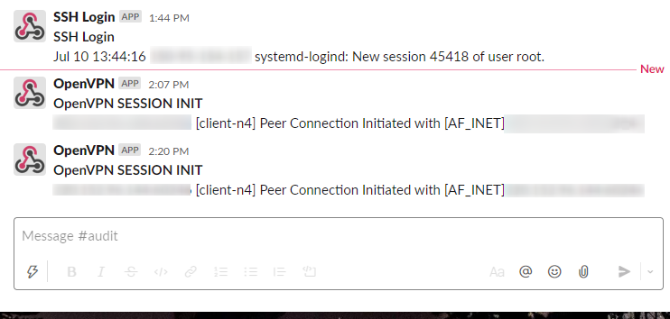

# openvpn_audiit_watchdog

## How to use(CentOS7)

### Precondition

- Install swatch on your server

```
yum install swatch --enablerepo=epel
```

- Create swatch config dir if don't

```
mkdir /etc/swatch.d
```

### Get Slack Incoming webhook url

<https://api.slack.com/messaging/webhooks>

### Install scripts

- need root account or sudo

```
# sh install.sh
```

## Demo

If someone logs in to your server using SSH or initializes an OpenVPN connection, Slack will be notified.


